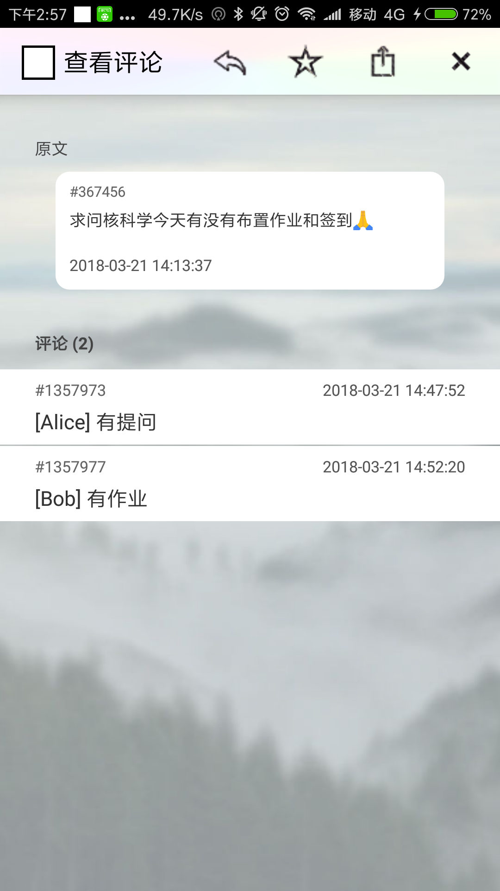
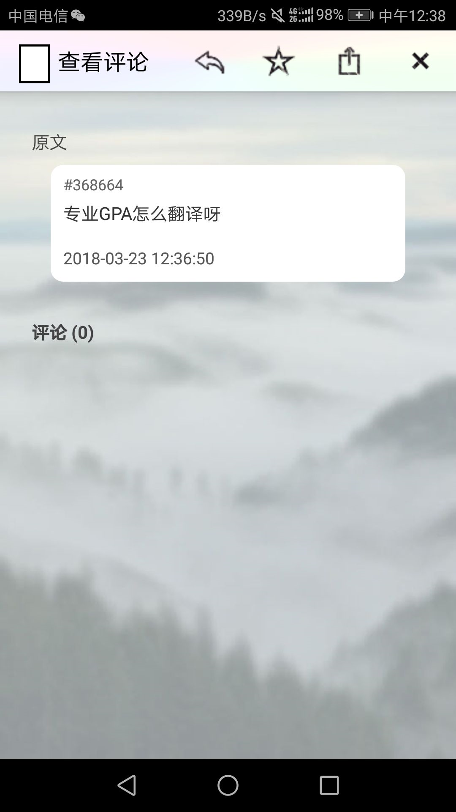
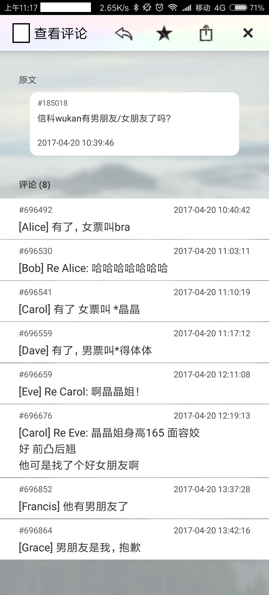

# 中大春哥树洞
## 同类产品分析
### 贴子内容浏览 content-view

页面从左至右依次是回复、关注、举报、返回。
* 左箭头是回复，然后点你想回复的评论就可以回复那个楼层；
* 五角星是关注，关注之后该贴子就会出现在主页中`我关注的`栏目内；
* 方框加一个上箭头是举报，点击之后会弹出举报框；
* 叉叉是返回，即返回主页。

原文（楼主）的贴子居中突出显示，隐含了该帖子讨论的主题；评论则按评论的时序逐条显示。

每条信息都用独特的ID来标识，并且有相应的时间戳。

回复评论与回复贴子的区别仅为加上了`Re XXX: `的前缀，回复评论的评论与回复帖子的评论无其他显著区别。

同一个人在一篇贴子里面所使用的匿名名称是唯一的，从下图中`[Carol]: Re Eve `可以看出来。

